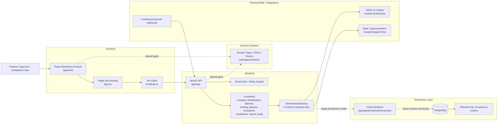
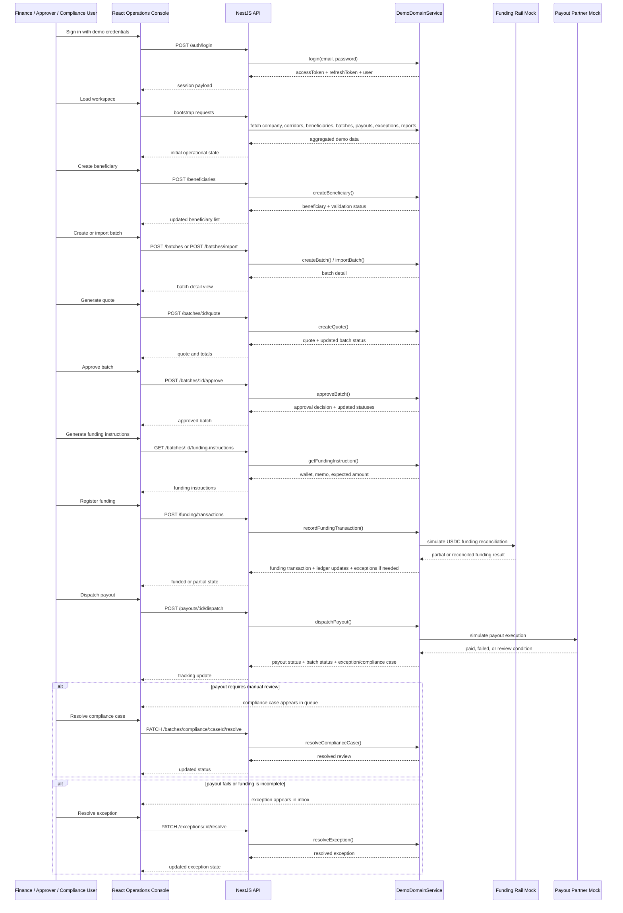
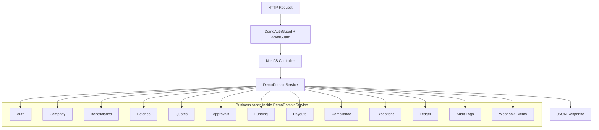
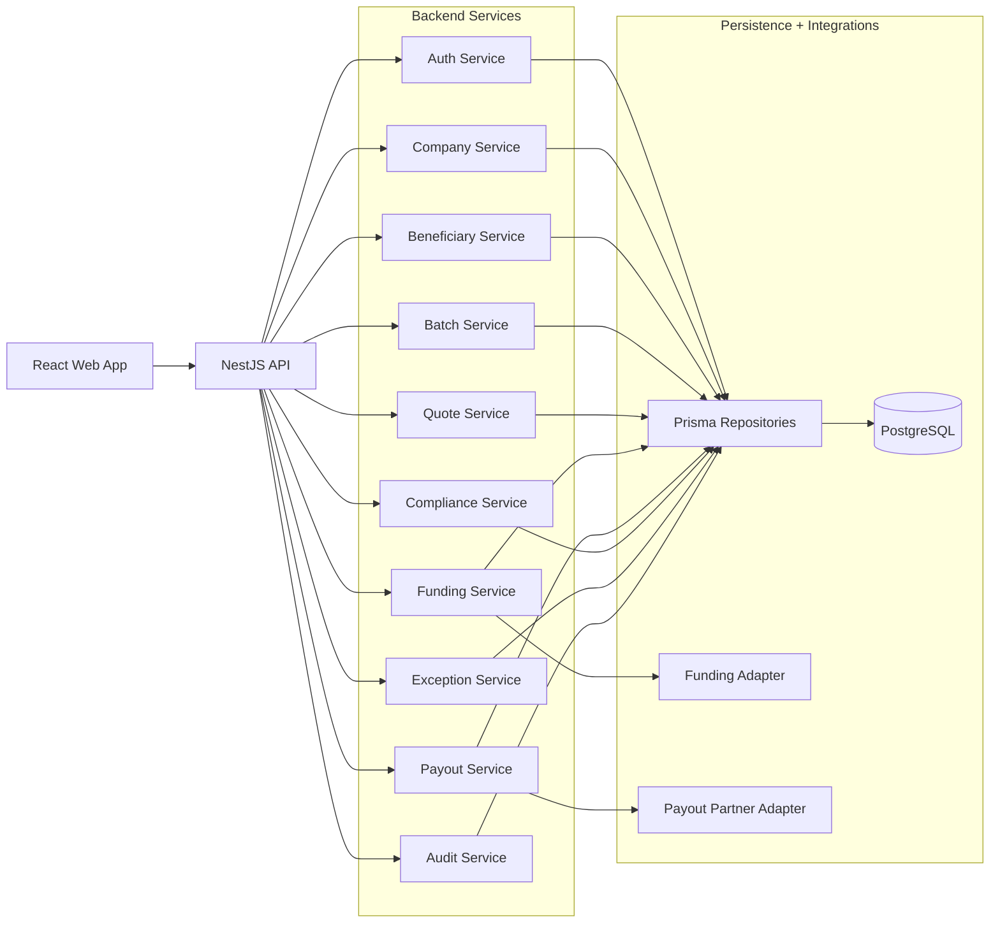

# End-to-End Architecture Diagram

This document explains how the main modules interact across the current MVP and how the architecture is structured today.

## 1. High-Level Architecture

## 2. Main Module Responsibilities

- `apps/web`: user-facing operations console for the payout workflow
- `packages/contracts`: shared contract layer between frontend and backend
- `apps/api`: HTTP API, guards, controllers, and business orchestration
- `DemoDomainService`: current source of truth for the MVP flow, using in-memory state
- `Prisma schema`: target database model for the next phase
- `PostgreSQL`: planned persistence layer, not yet active in the runtime flow
- `webhooks + partner mocks`: simulate external funding and payout events

## 3. Current Runtime Reality

Today, the real runtime path is:

`React UI -> API client -> NestJS controllers -> DemoDomainService -> in-memory state`

The database layer is modeled, but it is not yet the active source of truth.

## 4. End-to-End Operational Flow

## 5. Backend Internal Structure

## 6. Architectural Reading

The architecture is strong for a demo because the full product story is already represented in software.

The main tradeoff is that the current design is centralized:

- business logic is concentrated in one large in-memory service
- persistence is designed but not yet wired in
- external integrations are represented as mocks rather than real adapters

That makes the system fast to demo and iterate on, but it also marks the next architectural transition clearly:

`in-memory orchestration -> modular services/repositories -> Prisma runtime -> persistent operational platform`

## 7. Recommended Next Architecture Step

The cleanest next evolution would be:

This would preserve the current product flow while making the codebase much easier to evolve safely.
